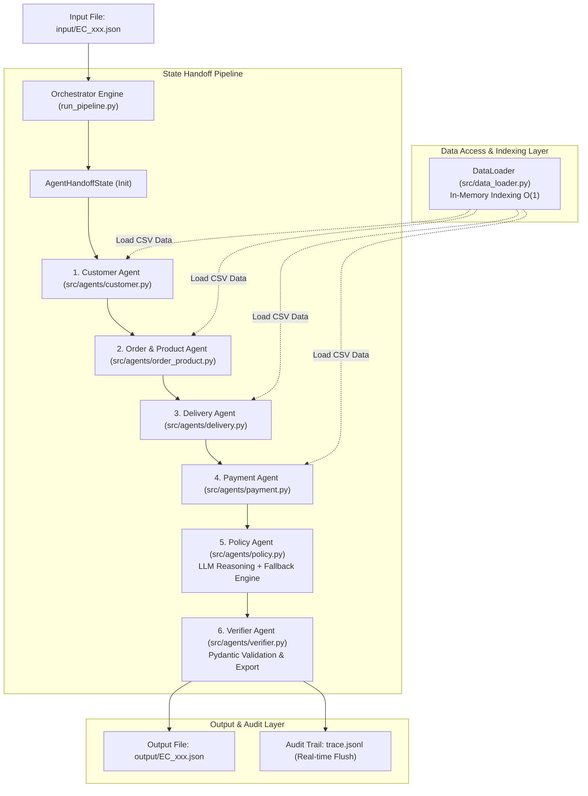

# Multi-Agent Architecture — Olist E-Commerce Dispute Resolution System

## 1. Tổng Quan Hệ Thống (Overview)

Hệ thống Multi-Agent được thiết kế để tự động hóa quy trình điều tra, đối soát dữ liệu và ra quyết định xử lý các khiếu nại khách hàng thương mại điện tử Olist theo bộ quy tắc chính sách `EC_POLICY_V2`.

Hệ thống áp dụng kiến trúc **Sequential Modular Multi-Agent Handoff Pipeline**. Toàn bộ quy trình xử lý từng hồ sơ (ticket) được điều phối thông qua một đối tượng trạng thái dùng chung duy nhất ([AgentHandoffState](file:///d:/Aithucchien/K4-DAY09-2A202601202-BuiXuanHoa/src/schema.py#L141-L194)). Trạng thái này liên tục được làm giàu (enrich) qua các Agent chuyên biệt theo từng miền dữ liệu (Customer, Order & Product, Delivery, Payment, Policy, Verifier), giúp đảm bảo:

- **Đầu ra có thể kiểm chứng (Verifiable Output)**: Mọi thông tin đối soát và quyết định hoàn tiền đều dựa trên bằng chứng dữ liệu thực tế từ 5 tập tin CSV Olist.
- **Tuân thủ quy định cuộc thi & Ràng buộc cứng (Hard Gate Rules)**: 
  - Mô hình LLM $\le 10\text{B}$ parameters (`qwen2.5:7b` / `phi3:mini`).
  - Ép giới hạn độ dài mảng (Array Limits) nghiêm ngặt tại từng Agent.
  - Làm tròn tiền tệ và giờ trễ chính xác đến 2 chữ số thập phân (`round(v, 2)`).
  - Xử lý giá trị `null` chuẩn xác đối với các đơn hàng không có item row.

---

## 2. Sơ Đồ Kiến Trúc Hệ Thống (Multi-Agent Flow Diagram)

---

## 3. Danh Sách Thành Phần, Vai Trò & Quyền Hạn Dữ Liệu (Component & Agent Roles)

| Thành phần / Agent | Vai trò / Chức năng | Quyền truy cập dữ liệu (Data Access) | Đầu ra cập nhật vào `AgentHandoffState` |
| :--- | :--- | :--- | :--- |
| **0. Orchestrator Engine** ([run_pipeline.py](file:///d:/Aithucchien/K4-DAY09-2A202601202-BuiXuanHoa/run_pipeline.py)) | Điều phối toàn bộ vòng đời xử lý case | Đọc danh sách file `input/EC_xxx.json` | Khởi tạo State gốc, điều phối Handoff, ghi log `trace.jsonl` |
| **0. Data Loader** ([src/data_loader.py](file:///d:/Aithucchien/K4-DAY09-2A202601202-BuiXuanHoa/src/data_loader.py)) | Nạp & Index dữ liệu vào RAM theo hashmap $O(1)$ | `olist_customers_dataset.csv` `olist_orders_dataset.csv` `olist_order_items_dataset.csv` `olist_order_payments_dataset.csv` `olist_products_dataset.csv` | Cung cấp API truy xuất $O(1)$ cho các Agent |
| **1. Customer Agent** ([src/agents/customer.py](file:///d:/Aithucchien/K4-DAY09-2A202601202-BuiXuanHoa/src/agents/customer.py)) | Tra cứu danh tính & lịch sử đơn hàng | API Data Loader (`orders`, `customers`, `customer_orders`) | `customer_unique_id`, `related_order_ids` ($\le 5$), `repeat_customer` |
| **2. Order & Product Agent** ([src/agents/order_product.py](file:///d:/Aithucchien/K4-DAY09-2A202601202-BuiXuanHoa/src/agents/order_product.py)) | Bóc tách sản phẩm, nhà bán & phân tích cấu trúc đơn | API Data Loader (`orders`, `order_items`, `products`) | `order_status`, `item_ids` ($\le 5$), `product_ids` ($\le 5$), `category_names` ($\le 5$), `seller_ids` ($\le 3$), `multi_item_order`, `multi_seller_order`, `multiple_categories` |
| **3. Delivery Agent** ([src/agents/delivery.py](file:///d:/Aithucchien/K4-DAY09-2A202601202-BuiXuanHoa/src/agents/delivery.py)) | Phân tích mốc thời gian ISO, độ lệch giờ trễ & nhà bán giao trễ | API Data Loader (`orders`, `order_items`) | `delivered_at`, `estimated_delivery_at`, `carrier_handoff_at`, `delivery_variance_hours`, `seller_handoff_analysis`, `late_handoff_seller_ids` |
| **4. Payment Agent** ([src/agents/payment.py](file:///d:/Aithucchien/K4-DAY09-2A202601202-BuiXuanHoa/src/agents/payment.py)) | Phân tích dòng thanh toán, tính toán giá trị & đối soát | API Data Loader (`order_items`, `order_payments`) | `payment_ids` ($\le 5$), `payment_types`, `split_payment`, `item_total_brl`, `freight_total_brl`, `expected_total_brl`, `payment_total_brl`, `difference_brl`, `reconciled` |
| **5. Policy Agent** ([src/agents/policy.py](file:///d:/Aithucchien/K4-DAY09-2A202601202-BuiXuanHoa/src/agents/policy.py)) | Đánh giá chính sách `EC_POLICY_V2` qua LLM & Deterministic Fallback | `AgentHandoffState` tích lũy + Prompt chính sách | `primary_issue`, `secondary_issues`, `root_cause_code`, `responsible_party_type`, `responsible_party_ids`, `recommended_refund_brl`, `resolution_actions` ($\le 5$), `evidence_ids` ($\le 20$), `confidence` |
| **6. Verifier Agent** ([src/agents/verifier.py](file:///d:/Aithucchien/K4-DAY09-2A202601202-BuiXuanHoa/src/agents/verifier.py)) | Xác thực Pydantic Schema, đóng gói JSON & xuất bản | `AgentHandoffState` hoàn chỉnh + [CaseOutputSchema](file:///d:/Aithucchien/K4-DAY09-2A202601202-BuiXuanHoa/src/schema.py#L122-L135) | File `output/EC_xxx.json` |

---

## 4. Luồng Truyền Dữ Liệu Chi Tiết (Pipeline Handoff Sequence)

1. **Khởi tạo (Initialization)**: `run_pipeline.py` nạp toàn bộ 5 file CSV vào bộ nhớ thông qua `DataLoader.load_data()`. Với mỗi ticket `input/EC_xxx.json`, hệ thống khởi tạo `AgentHandoffState` chứa `case_id`, `claimed_order_id` và `policy_version`.
2. **Ngữ cảnh Khách hàng (Customer Context)**: `CustomerAgent` truy vấn `customer_unique_id` tương ứng với `claimed_order_id`. Lấy danh sách các đơn hàng khác của khách hàng đó, ép giới hạn $\le 5$ phần tử cho `related_order_ids` và đánh giá cờ `repeat_customer` (`True` nếu số đơn khác > 0).
3. **Bóc tách Đơn hàng & Sản phẩm (Order & Product Context)**: `OrderProductAgent` lấy danh sách sản phẩm, nhà bán và danh mục. Tạo định danh item theo cú pháp `order_id:order_item_id`. Ép hạn mức mảng (`item_ids` $\le 5$, `product_ids` $\le 5$, `category_names` $\le 5$, `seller_ids` $\le 3$). Đánh giá các cờ nhị phân `multi_item_order`, `multi_seller_order`, `multiple_categories`.
4. **Phân tích Vận chuyển (Delivery Analysis)**: `DeliveryAgent` parse các mốc thời gian ISO (`delivered_at`, `estimated_delivery_at`, `carrier_handoff_at`). Tính `delivery_variance_hours` = $(\text{delivered} - \text{estimated}) / 3600$, làm tròn 2 chữ số thập phân. So sánh mốc `carrier_handoff_at` với `shipping_limit_date` của từng seller để xác định các nhà bán bàn giao hàng trễ (`late_handoff_seller_ids`).
5. **Đối soát Thanh toán (Payment Reconciliation)**: `PaymentAgent` tổng hợp dòng thanh toán, tạo `payment_ids` theo cú pháp `order_id:payment_sequential` (max 5). 
   - **Đơn hàng có item**: Tính `item_total_brl`, `freight_total_brl`, `expected_total_brl` = $\text{item\_total} + \text{freight\_total}$, `difference_brl` = $\text{payment\_total} - \text{expected\_total}$, và cờ `reconciled` ($|\text{difference\_brl}| \le 0.10$).
   - **Đơn hàng không có item row**: Gán `item_total_brl`, `freight_total_brl`, `expected_total_brl`, `difference_brl` và `reconciled` về `null` (`None`) theo đúng yêu cầu chính sách `EC_POLICY_V2`.
6. **Thực thi Chính sách (Policy Decision Engine)**: `PolicyAgent` xây dựng Prompt chứa đầy đủ ngữ cảnh đơn hàng và quy định `EC_POLICY_V2`, gửi tới Local LLM (`LocalLLMClient`).
   - **Thứ tự ưu tiên xét duyệt chính sách**:
     1. `canceled_order_paid`: Đơn bị hủy (`canceled`) nhưng đã thanh toán > 0 $\rightarrow$ Hoàn 100% `payment_total_brl`, chịu trách nhiệm: `platform` (`OLIST_PLATFORM`).
     2. `unavailable_order_paid`: Đơn không sẵn có (`unavailable`) nhưng đã thanh toán > 0 $\rightarrow$ Hoàn 100% `payment_total_brl`, chịu trách nhiệm: `platform` (`OLIST_PLATFORM`).
     3. `late_delivery_seller`: Giao trễ khách VÀ có Seller bàn giao trễ $\rightarrow$ Hoàn `freight_total_brl`, chịu trách nhiệm: `seller` (`late_handoff_seller_ids`).
     4. `late_delivery_logistics`: Giao trễ khách VÀ KHÔNG có Seller bàn giao trễ $\rightarrow$ Hoàn `freight_total_brl`, chịu trách nhiệm: `logistics_provider` (`LOGISTICS_PROVIDER`).
     5. `valid_split_payment`: Thanh toán chia tách (`split_payment=True`), đã đối soát thành công và không trễ hạn $\rightarrow$ Hoàn 0.0 BRL.
     6. `delivered_on_time`: Giao đúng hạn và đối soát thành công $\rightarrow$ Hoàn 0.0 BRL.
     7. `unsupported_late_claim`: Các trường hợp ngoài chính sách $\rightarrow$ Hoàn 0.0 BRL.
   - **Deterministic Fallback Guardrail**: Nếu LLM trả về số tiền hoàn 0.0 BRL cho các case thuộc nhóm 1-4, bộ lọc fallback sẽ tự động ép số tiền hoàn về đúng chuẩn `payment_total_brl` hoặc `freight_total_brl`.
   - **Tự động tổng hợp**: Tạo danh sách `secondary_issues`, mảng `resolution_actions` ($\le 5$) và mảng `evidence_ids` ($\le 20$).
7. **Xác minh & Đóng gói Đầu ra (Verification & Export)**: `VerifierAgent` ánh xạ `AgentHandoffState` sang Pydantic `CaseOutputSchema`. Đặt `case_status` là `"action_required"` nếu `recommended_refund_brl > 0`, ngược lại `"no_action"`. Đóng gói file JSON ghi vào `output/EC_xxx.json` và ghi lại dòng log thực thi vào `trace.jsonl`.

---

## 5. Ràng Buộc Dữ Liệu & Quy Tắc Kiểm Soát (Data Integrity & Boundary Rules)

| Tiêu chí | Quy tắc áp dụng | Mã nguồn triển khai |
| :--- | :--- | :--- |
| **Array Bounds Limit** | - `order_ids`: Max 5 - `item_ids`: Max 5 - `product_ids`: Max 5 - `category_names`: Max 5 - `seller_ids`: Max 3 - `payment_ids`: Max 5 - `resolution_actions`: Max 5 - `evidence_ids`: Max 20 | [src/schema.py](file:///d:/Aithucchien/K4-DAY09-2A202601202-BuiXuanHoa/src/schema.py) [src/agents/order_product.py](file:///d:/Aithucchien/K4-DAY09-2A202601202-BuiXuanHoa/src/agents/order_product.py) |
| **Decimal Rounding** | Làm tròn 2 chữ số thập phân cho mọi giá trị số thực (`delivery_variance_hours`, `handoff_variance_hours`, `item_total_brl`, `freight_total_brl`, `expected_total_brl`, `payment_total_brl`, `difference_brl`, `recommended_refund_brl`). | `@field_validator` trong Pydantic Schemas & helper `round(v, 2)` |
| **Null Values Handling** | Nếu đơn hàng không có dòng item trong `order_items`, các trường đối soát `expected_total_brl`, `difference_brl`, `reconciled` phải là `null` (`None`). | [src/agents/payment.py](file:///d:/Aithucchien/K4-DAY09-2A202601202-BuiXuanHoa/src/agents/payment.py#L51-L60) |
| **Reconciliation Threshold** | Đơn hàng được coi là `reconciled = True` khi $| \text{difference\_brl} | \le 0.10$ BRL. | [src/agents/payment.py](file:///d:/Aithucchien/K4-DAY09-2A202601202-BuiXuanHoa/src/agents/payment.py#L66) |
| **Case Status Rule** | `case_status = "action_required"` nếu `recommended_refund_brl > 0`, ngược lại `"no_action"`. | [src/agents/verifier.py](file:///d:/Aithucchien/K4-DAY09-2A202601202-BuiXuanHoa/src/agents/verifier.py#L40) |

---

## 6. Thông Số Mô Hình & Khai Báo Bảo Mật (Security & Model Declarations)

- **Tên mô hình (`model_name`)**: `qwen2.5:7b` / `phi3:mini` (Khai báo cứng trong [src/config.py](file:///d:/Aithucchien/K4-DAY09-2A202601202-BuiXuanHoa/src/config.py) & [metadata.json](file:///d:/Aithucchien/K4-DAY09-2A202601202-BuiXuanHoa/metadata.json)).
- **Kích thước tham số (`parameter_size`)**: `7B` (Tuân thủ tuyệt đối quy định cuộc thi $\le 10\text{B}$ parameters).
- **Framework**: Custom Sequential Handoff Multi-Agent Pipeline / Python 3.10+ / Pydantic v2 / Local Ollama API.
- **Quản lý Bảo mật Secret**: Tất cả API Key / Secret Token nếu có được bảo vệ hoàn toàn trong file `.env` cục bộ và được chặn bởi file [.gitignore](file:///d:/Aithucchien/K4-DAY09-2A202601202-BuiXuanHoa/.gitignore) (không commit lên Git repository).

