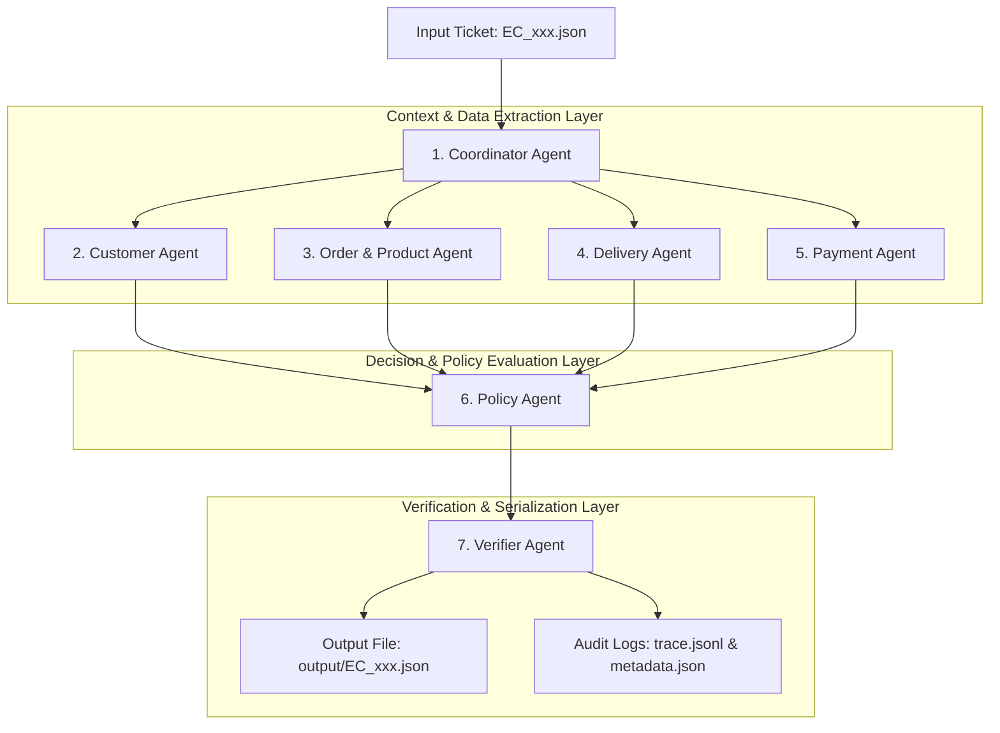

# Multi-Agent Architecture — Olist E-Commerce Dispute Resolution

## 1. Tổng Quan Hệ Thống (Overview)
Hệ thống Multi-Agent được thiết kế để tự động hóa quy trình điều tra, đối soát và ra quyết định xử lý 50 khiếu nại khách hàng thương mại điện tử Olist theo chính sách `EC_POLICY_V2`.

Hệ thống áp dụng kiến trúc **Modular Multi-Agent Handoff**, chia nhỏ các nhiệm vụ phức tạp cho 7 Agent chuyên biệt. Mỗi Agent phụ trách một miền dữ liệu cố định (Customer, Order/Product, Delivery, Payment, Policy, Verification), giúp đảm bảo:
- **Đầu ra có thể kiểm chứng (Verifiable Output)**: Dựa trên bằng chứng thực tế từ 9 file CSV dữ liệu Olist.
- **Tuân thủ tuyệt đối quy định cuộc thi**: Không vượt quá 10B parameters, không vi phạm lỗi Hard Gate Error (Array Limits & Decimal Rounding).

---

## 2. Sơ Đồ Kiến Trúc Hệ Thống (Multi-Agent Flow Diagram)

---

## 3. Danh Sách Agent, Vai Trò & Quyền Hạn Dữ Liệu (Agent Roles & Permissions)

| Tên Agent | Vai trò / Chức năng | Quyền truy cập dữ liệu (Data Access) | Đầu ra truyền đi (`AgentHandoffState`) |
| :--- | :--- | :--- | :--- |
| **1. Coordinator Agent** | Master Orchestrator | Đọc ticket JSON (`input/EC_xxx.json`) | Khởi tạo state gốc (`case_id`, `claimed_order_id`) |
| **2. Customer Agent** | Tra cứu danh tính & lịch sử khách hàng | `olist_customers_dataset.csv` `olist_orders_dataset.csv` | `customer_unique_id`, `related_order_ids` (max 5), `repeat_customer` |
| **3. Order & Product Agent** | Bóc tách mặt hàng, sản phẩm, nhà bán & danh mục | `olist_order_items_dataset.csv` `olist_products_dataset.csv` | `item_ids`, `product_ids`, `category_names`, `seller_ids`, `multi_item_order`, `multi_seller_order`, `multiple_categories` |
| **4. Delivery Agent** | Phân tích mốc thời gian & độ lệch giờ trễ | Mốc thời gian trong `orders` & `order_items` | `delivered_at`, `estimated_delivery_at`, `carrier_handoff_at`, `delivery_variance_hours`, `seller_handoff_analysis`, `late_handoff_seller_ids` |
| **5. Payment Agent** | Đối soát tài chính & phương thức thanh toán | `olist_order_payments_dataset.csv` `olist_order_items_dataset.csv` | `payment_ids`, `payment_types`, `item_total_brl`, `freight_total_brl`, `expected_total_brl`, `payment_total_brl`, `difference_brl`, `reconciled`, `split_payment` |
| **6. Policy Agent** | Đánh giá quy tắc chính sách `EC_POLICY_V2` | Dữ liệu tổng hợp từ `AgentHandoffState` | `primary_issue`, `secondary_issues`, `root_cause_code`, `responsible_party_type`, `responsible_party_ids`, `recommended_refund_brl`, `resolution_actions`, `evidence_ids` |
| **7. Verifier Agent** | Kiểm tra Schema & Đóng gói JSON đầu ra | Pydantic Schema ([src/schema.py](file:///d:/Aithucchien/K4-DAY09-2A202601202-BuiXuanHoa/src/schema.py)) | File JSON hợp lệ tại `output/EC_xxx.json` |

---

## 4. Luồng Truyền Dữ Liệu Chi Tiết (Pipeline Handoff Sequence)

1. **Bước 1 (Khởi tạo Case)**: `CoordinatorAgent` nhận ticket từ `input/`, bóc tách `claimed_order_id` và khởi tạo đối tượng `AgentHandoffState`.
2. **Bước 2 (Ngữ cảnh Khách hàng)**: `CustomerAgent` dùng `claimed_order_id` tìm `customer_unique_id` và các đơn hàng lịch sử khác (`related_order_ids`), ép giới hạn mảng $\le 5$ phần tử và bật cờ `repeat_customer`.
3. **Bước 3 (Ngữ cảnh Đơn hàng & Sản phẩm)**: `OrderProductAgent` lấy danh sách sản phẩm, nhà bán hàng, danh mục sản phẩm, đánh giá các cờ `multi_item_order`, `multi_seller_order`, `multiple_categories` và ép hạn mức mảng (max 5 items, max 5 products, max 5 categories, max 3 sellers).
4. **Bước 4 (Phân tích Vận chuyển)**: `DeliveryAgent` parse các mốc thời gian ISO, tính `delivery_variance_hours` (số giờ trễ giao khách) và `handoff_variance_hours` (số giờ trễ bàn giao đơn vị vận chuyển), làm tròn **2 chữ số thập phân**.
5. **Bước 5 (Đối soát Thanh toán)**: `PaymentAgent` tính toán `item_total_brl`, `freight_total_brl`, `expected_total_brl`, `payment_total_brl`, `difference_brl` và xác định cờ `reconciled` ($|\text{difference}| \le 0.10$ BRL). Với đơn không item, ép các trường về `null`.
6. **Bước 6 (Thực thi Chính sách)**: `PolicyAgent` đánh giá thứ tự ưu tiên chính sách `EC_POLICY_V2`:
   - Xác định 1 trong 6 Primary Issues (`canceled_order_paid`, `unavailable_order_paid`, `late_delivery_seller`, `late_delivery_logistics`, `valid_split_payment`, `unsupported_late_claim`).
   - Xếp Secondary Issues theo đúng 5 thứ tự nghiệp vụ cố định.
   - Phân định bên chịu trách nhiệm (`platform`, `seller`, `logistics_provider`, `none`) và tính `recommended_refund_brl`.
   - Sắp xếp mảng `resolution_actions` và dựng mảng `evidence_ids` có thể kiểm chứng.
7. **Bước 7 (Xác minh & Xuất bản)**: `VerifierAgent` kiểm tra toàn bộ cấu trúc theo Pydantic `CaseOutputSchema`, gán `case_status` (`action_required` nếu hoàn tiền > 0, ngược lại `no_action`), xuất file JSON chuẩn vào `output/` và ghi nhật ký thực thi `trace.jsonl`.

---

## 5. Khai Báo Bảo Mật & Thông Số Mô Hình (Security & Model Declarations)

* **Tên mô hình (`model_name`)**: `qwen2.5-7b-instruct`
* **Kích thước tham số (`parameter_size`)**: `7B` (Tuân thủ ràng buộc $\le$ 10B parameters)
* **Framework**: Custom Multi-Agent Handoff Pipeline / Python 3.10+
* **Quản lý Bảo mật Secret**: Tất cả API Key / Secret Token nếu có được bảo vệ hoàn toàn trong file `.env` cục bộ và được chặn bởi file [.gitignore](file:///d:/Aithucchien/K4-DAY09-2A202601202-BuiXuanHoa/.gitignore) (không commit lên Git).
