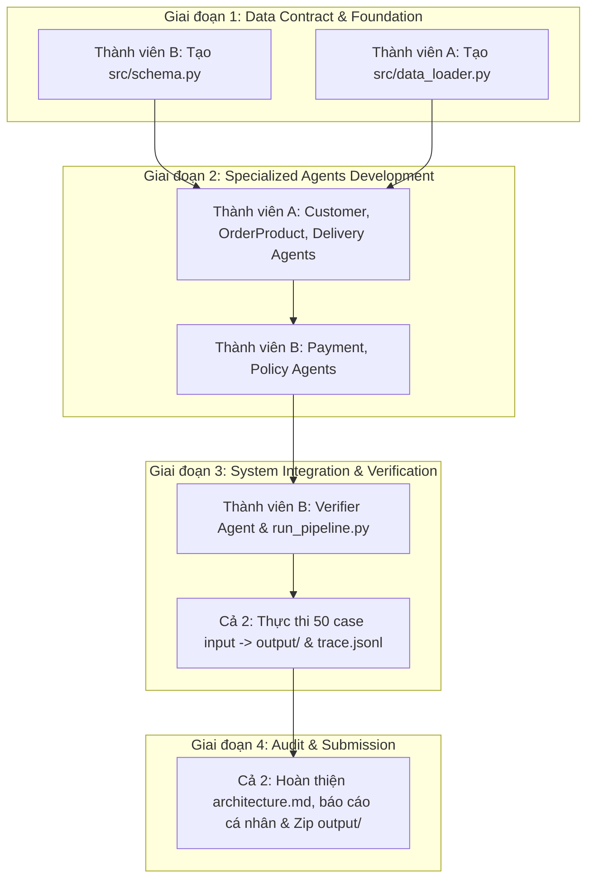

# Bảng Phân Công Công Việc Nhóm 2 Thành Viên — Multi-Agent Dispute Resolution

> **Dự án**: K4 Day 09 - Multi-Agent E-commerce Dispute Resolution  
> **Chính sách áp dụng**: `EC_POLICY_V2`  
> **Quy mô nhóm**: 2 thành viên  

---

## 1. Bảng Phân Công Chi Tiết (Matrix Assignment)

| Vai trò / Thành viên | Module / Deliverable | File / Hàm phụ trách | Input nhận vào | Output bàn giao | Trạng thái |
| :--- | :--- | :--- | :--- | :--- | :---: |
| **Thành viên A** *(Data Engine & Context Specialist)* | **Data Loader Layer** | `src/data_loader.py` | 9 file CSV dữ liệu Olist tại `data/` | Data indexing & Tra cứu $O(1)$ (`get_order_full_context`) | Sẵn sàng |
| | **Customer Agent** | `src/agents/customer.py` | `customer_id`, `customer_unique_id` | `customer_context` (`customer_unique_id`, `related_order_ids`, `repeat_customer`) | Sẵn sàng |
| | **Order & Product Agent** | `src/agents/order_product.py` | `order_items`, `products` | Entities (`item_ids`, `product_ids`, `category_names`, `multi_item`, `multi_seller`, `multiple_categories`) | Sẵn sàng |
| | **Delivery Agent** | `src/agents/delivery.py` | Order delivery timestamps, `shipping_limit_date` | `delivery_analysis` (`delivery_variance_hours`, `handoff_variance_hours`, `late_handoff_seller_ids`) | Sẵn sàng |
| **Thành viên B** *(Policy, Verifier & Orchestration Specialist)* | **Schema & Quality Control** | `src/schema.py` `src/agents/verifier.py` | JSON Handoff State | Pydantic Output Validation, Ép giới hạn mảng (Array Limits), Verify Evidence IDs, làm tròn 2 chữ số | Sẵn sàng |
| | **Payment Agent** | `src/agents/payment.py` | `order_payments`, `order_items` | `payment_reconciliation` (`item_total`, `freight_total`, `expected_total`, `payment_total`, `difference_brl`, `reconciled`) | Sẵn sàng |
| | **Policy Agent** | `src/agents/policy.py` | Context & Handoff State từ các Agent | `EC_POLICY_V2` Evaluation (`primary_issue`, `secondary_issues`, `responsible_parties`, `refund_brl`, `actions`) | Sẵn sàng |
| | **Orchestrator & Audit Logs** | `run_pipeline.py` `metadata.json` `architecture.md` | 50 file `EC_xxx.json` từ `input/` | 50 file JSON chuẩn trong `output/`, `trace.jsonl`, `metadata.json`, `architecture.md` | Sẵn sàng |

---

## 2. Quy Trình Phối Hợp Handoff Giữa 2 Thành Viên

1. **Giai đoạn 1 (Khởi tạo Data Contract & Loader)**: 
   - **Thành viên B** định nghĩa `src/schema.py` đính kèm các ràng buộc validation (Array Limits, Type definitions).
   - **Thành viên A** viết `src/data_loader.py` để nạp 9 CSV và xây dựng hàm tra cứu $O(1)$.
2. **Giai đoạn 2 (Phát triển Agents chuyên biệt)**:
   - **Thành viên A** phát triển 3 Agent lấy ngữ cảnh (`Customer`, `OrderProduct`, `Delivery`).
   - **Thành viên B** phát triển `Payment Agent` và `Policy Agent` (cài đặt chính xác 6 Primary issues & 5 Secondary issues của `EC_POLICY_V2`).
3. **Giai đoạn 3 (Tích hợp & Kiểm thử)**:
   - **Thành viên B** viết `Verifier Agent` và `run_pipeline.py` để kết nối cả pipeline.
   - Cả 2 cùng chạy pipeline trên 50 case, kiểm tra độ chính xác của file xuất ra trong `output/`.
4. **Giai đoạn 4 (Báo cáo & Đóng gói)**:
   - **Thành viên B** cập nhật `architecture.md` và `metadata.json`.
   - Cả 2 thành viên điền kết quả vào file báo cáo cá nhân `individual_5SoCuoiMHV_HoVaTen.md` (đổi tên tương ứng với MSSV của từng người).
   - Nén thư mục `output/` thành file zip để nộp.
